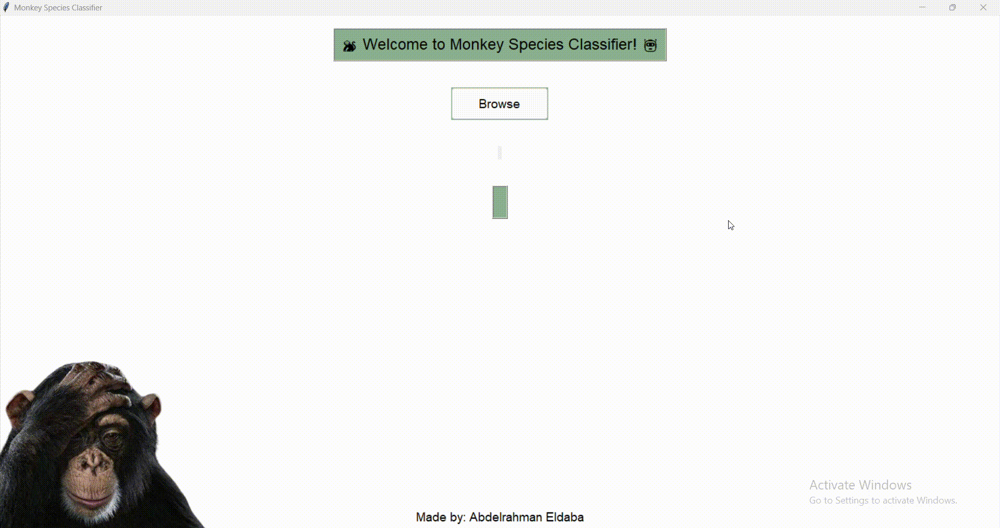

# Monkey Species Classifier Project 🐒🤖
Welcome to the Monkey Species Classifier project repository! 🚀

## Overview:
This project involves training a Convolutional Neural Network (CNN) to classify images of 10 different monkey species. The model achieved impressive accuracy and can predict the species of monkeys in new images.

## Key Highlights:
- **Data Exploration:** Explored a diverse dataset containing images of Bald Uakari, Emperor Tamarin, Golden Monkey, Gray Langur, Hamadryas Baboon, Mandrill, Proboscis Monkey, Red Howler, Vervet Monkey, and White-Faced Saki. 🐒🌈

- **Data Preprocessing:** Split the data, applied data augmentation, and visualized color distributions. 🔄🎨

- **Model Definition and Training:** Built a robust CNN model, achieved great accuracy, and visualized the training history. 💻📈

- **Model Evaluation:** Evaluated the model on a test set, generated a confusion matrix, and presented a detailed classification report. 🧐📊

- **Predictions on New Images:** Saved the trained model and showcased predictions on new monkey images. 🔮🖼️

- **Simple Deployment:** Created a user-friendly GUI using Tkinter. Now, anyone can easily predict the monkey species by browsing images! 🖱️🐒
### Demo Predicting using the GUI

### Explore the notebook on [Kaggle](https://www.kaggle.com/code/abdelrahmanahmed110/ten-monkey-species-classification). 🚀
### Connect with me on [LinkedIn](https://www.linkedin.com/in/abdelrahman-eldaba-739805192/). 🌐

Feel free to explore, provide feedback, and connect with me for discussions and collaborations! 🤝🚀
